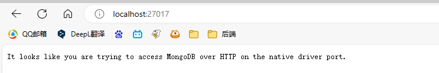

# 为什么出现Promise

解决嵌套回调（回调地狱）

```
请求1(function (结果1) {
  请求2(function (结果2) {
    请求3(function (结果3) {
      请求4(function (结果4) {
        ...
      });
    });
  });
});
```

​	

# Promise状态

pending 		等待

fulfilled 		 成功

rejected		 失败

```js
/*
      Promise 实例化对象的状态只能从 pending 到 fulfilled 或者是 pending 到 reject
      不能从 fulfilled 到 rejected 或者反之都不行
    */

const p1 = new Promise((resolve,reject)=>{
    //调整状态
    // resolve('ok')  //成功
    reject('error')  //失败
})

console.log(p1)
```


# Promise的then

- then:指定用于得到成功value的成功回调和用于得到失败reason的失败的回调，并且将返回一个新的Promise实例化对象
- 成功的状态：执行then方法的第一个回调函数
- 失败的状态：执行then方法的第二个回调函数
- then 方法的返回值Promise实例化对象的状态取决于回调函数中的内容
- 如果返回为非Promise实例化对象，则得到一个是成功的Promise
- 如果返回的是Promise实例化对象，则Promise实例化对象的状态和结果值将直接影响result
- 如果为抛出异常，则新的Promise实例化对象（result）为失败的Promise

```js
const p1 = new Promise((resolve, reject) => {
    resolve("ok");
    // reject('err')
});

const result = p1.then((value)=>{
    return new Promise((resolve,reject)=>{
        // resolve(value);
        throw new Error('异常信息')
    })
},(reason)=>{
    return new Promise((resolve,reject)=>{
        reject('err')
    })
})

console.log('result',result)
```


# Promise的链式调用

```js
const p1 = new Promise((resolve,reject)=>{
    resolve('ok')
})

p1.then(val=>{
    console.log('第一步')
}).then(val=>{
    console.log('第二步')
}).then(val=>{
    console.log('第三步')
}).then(val=>{
    console.log('第四步')
}).then(val=>{
    console.log('第五步')
})
```


## 案例-使用promise的链式调用读取文件

```js
// 1.导入模块
const fs = require("fs");

// 2.创建Promise实例化对象
new Promise((resolve, reject) => {
  fs.readFile("./1.txt", (err, data) => {
    if (err) reject(err);
    resolve(data);
  });
})
  .then((val) => {
    return new Promise((resolve, reject) => {
      fs.readFile("./2.txt", (err, data) => {
        if (err) reject(err);
        resolve([val, data]);
      });
    });
  })
  .then((val) => {
    return new Promise((resolve, reject) => {
      fs.readFile("./3.txt", (err, data) => {
        if (err) reject(err);
        resolve([...val, data]);
      });
    });
  })
  .then((val) => {
    console.log(val.toString());
  });

```


## 案例-使用promise进行数据库操作 mongodb

安装 *mongoose* 模块

```
npm init -y
npm i mongoose
```


官网安装mongodb [MongoDB：应用程序数据平台 | MongoDB](https://www.mongodb.com/zh-cn)

输入命令启动 MondoDB 服务

```
mongod   --dbpath 存放数据库的地址
如
mongod   --dbpath D:\codeing\learn\learn_js_promise\mongodb
```

浏览器中输入地址和端口号为：

[http://localhost:27017](http://localhost:27017/)

显示结果如下，就说明安装成功并结束




进行mongodb操作

```js
// 1.导入模块
const mongoose = require("mongoose");
// 2.创建Promise实例化对象
new Promise((resolve, reject) => {
  // 3.链接数据库
  mongoose.connect("mongodb://127.0.0.1:27017/project");
  mongoose.connection.on("open", () => {
    // 连接成功的情况
    resolve();
  });
  mongoose.connection.on("error", () => {
    // 连接失败的情况
    reject();
  });
}).then(
  (val) => {
    // 创建结构
    const noteSchema = new mongoose.Schema({
      title: String,
      content: String,
    });

    // 创建模型
    const noteModel = mongoose.model("notes", noteSchema);

    // 读取操作
    noteModel.find().then(
      (val) => {
        console.log(val);
      },
      (reason) => {
        console.log(reason);
      }
    );
  },
  (reason) => {
    console.log("链接数据库失败");
  }
);
```

## 案例-封装一个函数用于读取文件

```js
// 导入模块
const fs = require("fs");
// 封装一个函数
function ReadFileFun(path) {
  return new Promise((resolve, reject) => {
    fs.readFile(path, (err, data) => {
      //判断
      if (err) {
        reject(err);
      } else {
        resolve(data);
      }
    });
  });
}

// 调用

ReadFileFun("../05.Promise的链式调用-读取文件/1.txt").then(
  (val) => {
    console.log(val.toString());
  },
  (reason) => {
    console.log("reason", reason);
  }
);
```


# Promise.all

 Promise 下的 all 方法作用主要是针对多个 Promise的异步任务的处理

 需要接受一个数组类型的参数

 返回值：Promise 对象，状态也是由数组中的每一个 Promise 对象的状态来决定的

​				当所有的 Promise 对象的状态都是成功的，最终的结果就是成功的，结果值是由每一个 Promise 的结果值组成的数组

​				当所有的 Promise 对象的状态但凡有一个是失败的，最终也是失败的 Promise，结果值就是失败的这个 Promise 的结果值


```js
let p1 = new Promise((resolve, reject) => {
  resolve("ok");
});

let p2 = new Promise((resolve, reject) => {
  resolve("ok");
});

let p3 = new Promise((resolve, reject) => {
  reject("error");
});

let p4 = new Promise((resolve, reject) => {
  resolve("ok");
});

Promise.all([p1, p2, p3, p4]).then(
  (results) => {
    console.log(results);
  },
  (error) => {
    console.log(error);
  }
);
```


## 案例-模拟接口请求数据

```html
<!DOCTYPE html>
<html lang="en">
<head>
  <meta charset="UTF-8">
  <meta name="viewport" content="width=device-width, initial-scale=1.0">
  <title>案例1-模拟接口请求数据</title>
</head>
<body>
    <script>
      //模拟请求用户列表的数据
      function getUserList(){
        return new Promise(function(resolve,reject){
          //定时器模拟异步
          setTimeout(function(){
            resolve('请求用户列表的数据...') 
          },1000)
        })
      }

      //模拟请求轮播图的数据
      function getBanner(){
        return new Promise(function(resolve,reject){
          //定时器模拟异步
          setTimeout(function(){
            resolve('请求轮播图的数据...') 
          },2000) 
        })
      }
      
      //模拟请求视频列表的数据
      function getVideoList(){
        return new Promise(function(resolve,reject){
          //定时器模拟异步
          setTimeout(function(){
            resolve('请求视频列表的数据...') 
          },3000) 
        })
      }
    
      // 模拟程序启动加载
      function initLoad() { 
        Promise.all([getUserList(),getBanner(),getVideoList()]).then(function(res){
          console.log(res)
        })
      }
      initLoad()
    </script>
</body>
</html>
```

## 案例-读取文件

```js
// 1.导入模块
const fs = require("fs");
const util = require("util");

// 2.调用方法
const myreadFile = util.promisify(fs.readFile);

// 3.读取文件
let one = myreadFile("./1.txt");
let two = myreadFile("./2.txt");
let three = myreadFile("./3.txt");

// 4.处理结果
let result = Promise.all([one, two, three]);
result.then(
  (res) => {
    console.log(String(res));
  },
  (rea) => {
    console.log("rea", rea);
  }
);
```

# Promise.allSettled

```html
  <!DOCTYPE html>
  <html lang="en">
  <head>
    <meta charset="UTF-8">
    <meta name="viewport" content="width=device-width, initial-scale=1.0">
    <title>Document</title>
  </head>
  <body>
    <script>
      //封装 AJAX 函数 
      function ajax(url) {
        return new Promise(function (resolve, reject) {
          let xhr = new XMLHttpRequest();
          xhr.open('GET', url, true);
          xhr.send()
          xhr.onreadystatechange = function () {
            if (xhr.readyState == 4) {
              if (xhr.status >= 200 && xhr.status<300) {
                resolve(xhr.responseText)
              } else { 
                reject(xhr.responseText)
              }
            }
          }
        })
      }


      /**
       * allSettled 方法用来确定一组异步的操作是否都结束了（不管是成功还是失败）
       * 其中包含了 fulfilled 和 rejected两种情况
       */


    Promise.allSettled([
      ajax('http://iwenwiki.com/api/blueberrypai/getChengpinInfo.php'),
      ajax('http://iwenwiki.com/api/blueberrypai/getListeningInfo.php')
    ]).then(val=>{
      //过滤成功和失败两种情况
      let successList = val.filter (item=>item.status == 'fulfilled')
      let failList = val.filter (item=>item.status == 'rejected')
      console.log(successList)
      console.log(failList)
    }).catch(err=>{
      console.log(err)
    })
    </script>
  </body>
  </html>
```

